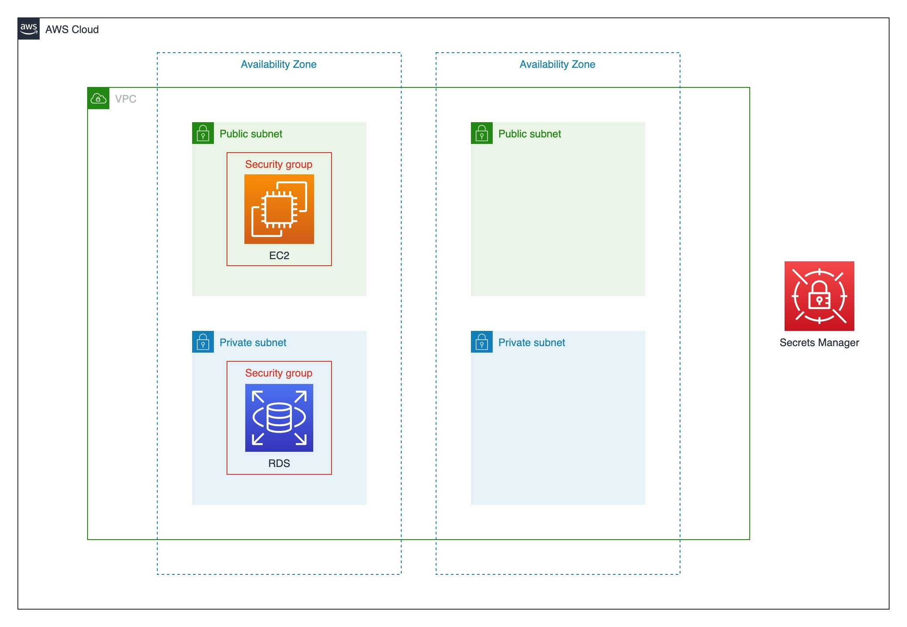

# CDK LAB for RDS

This is a simple Lab environment for quickly building a Database and its peripheral infrastructures.



## Components to be deployed

* IAM Stack (`cdk-<prefix>-iam-stack`)
  * A secret contains the necessary information to login database, including database identifier, username and password
  * A role called `EC2SSMInstanceProfile` with some policies
    *  `AmazonSSMManagedInstanceCore` managed policy to connect to the EC2 instance used as development environment
    *  `ReadDBSecretPolicy` custom policy to read the secret
    *  `DescribeDBInstancesPolicy` custom policy to list the database's name
* VPC Stack (`cdk-<prefix>-vpc-stack`)
  * A brand new VPC with 2 Availability Zones to create subnets
  * 2 public subnets in each AZ
  * 2 private subnets in each AZ
  * A security group for EC2 instances
  * A security group for RDS database instances, allow inbound connection to connect database from the instance with EC2's security group
* EC2 Stack (`cdk-<prefix>-ec2-stack`)
  * A `t3.micro` free instance with
    * A `EC2SSMInstanceProfile` role attached
    * Pre-installed database command line client
    * 2 scripts to help users manipulate the database:
      * `/srv/install_example_database.sh`: Load the example database into RDS database instance
      * `/srv/login_database.sh`: Login to the database
* RDS Stack (`cdk-<prefix>-rds-stack`)
  * A RDS for MySQL/MariaDB/PostgreSQL database instance in private subnets

## Prerequisite: Set environment variables

Either provide a `.env` file or set the environment variables before deploy the stacks. The easy way is copying the `.env.example` file to `.env` and replace the variables, including:

* `REGION`: The default region to create the resources (e.g. `us-east-2`)
* `STACKNAME_PREFIX`: The prefix string of each stack
* `DB_ENGINE`: Choose one from `MySQL`, `MariaDB` or `PostgreSQL`
* `DB_IDENTIFIER`: Database identifier
* `DB_USERNAME`: Database's default username
* `DB_PASSWORD`: Database's default password. Please make sure the password meets the complexity requirement of the database engine

Here is a sample `.env` file:

```
REGION=us-east-2
STACKNAME_PREFIX=mylab
DB_ENGINE=MySQL
DB_IDENTIFIER=database
DB_USERNAME=username
DB_PASSWORD=password
```

## Quickstart

1. Set environment variables
2. Deploy all stacks at once by executing `cdk deploy --all` command
3. Login to AWS console, enter EC2 service, check the instance we just created and click "Connect" button, navigate to "Session Manager" tab and click "Connect" button
4. Execute `/srv/install_example_database.sh` to load the example database into RDS database instance
5. Execute `/srv/login_database.sh` to login to the database with the command line client


## Usage

Deploy stacks:

```bash
cdk deploy <stack name>  # Deploy specitic stack
cdk deploy cdk-iam  # e.g: Deploy the IAM stack if no STACKNAME_PREFIX specified
cdk deploy cdk-mylab-iam  # e.g: Deploy the IAM stack if the STACKNAME_PREFIX is assigned as "mylab"
cdk deploy --all # Deploy all stacks
cdk deploy --all --require-approval=never  # Deploy all stacks without asking yes or no
```

Destroy stacks:

```bash
cdk destroy <stack name>  # Destroy specitic stack
cdk destroy cdk-iam  # e.g: Destroy the IAM stack if no STACKNAME_PREFIX specified
cdk destroy cdk-mylab-iam  # e.g: Destroy the IAM stack if the STACKNAME_PREFIX is assigned as "mylab"
cdk destroy --all # Destroy all stacks
```

All available stacks:

* `cdk-<STACKNAME_PREFIX>-iam`
* `cdk-<STACKNAME_PREFIX>-ec2`
* `cdk-<STACKNAME_PREFIX>-vpc`
* `cdk-<STACKNAME_PREFIX>-rds`
